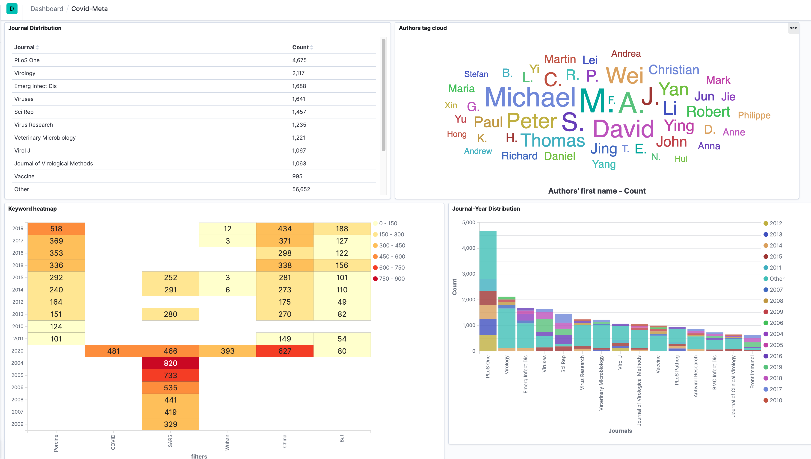

# COVID Open Research Dataset Indexing and Visualization

## Data preparation
You can find all COVID19-related datasets [here](https://pages.semanticscholar.org/coronavirus-research).
I am using [Metadata file](https://ai2-semanticscholar-cord-19.s3-us-west-2.amazonaws.com/2020-03-27/metadata.csv) and 
[Commercial use subset](https://ai2-semanticscholar-cord-19.s3-us-west-2.amazonaws.com/2020-03-27/comm_use_subset.tar.gz) (click to download).

Make sure you have a `raw_data/` folder to hold all your data files.

## Getting set up
Make sure your elasticsearch and kibana have the same version.
I am testing on MacOS with version 7.5.0. After install the elastic packages, run:

```
./bin/elasticsearch
./bin/kibana
```

## Inspect your single json doc:

```
./inspect.sh
```


## Parse Meta data and Build Elasticseach index

```
./build_index.sh
```


## Inspect your Elasticsearch index in Kibana and more
By default, you can visit kibana interface at `http://localhost:5601`. After you 
see the web app, go to `Management` on the left-side bar. Click `Index Management` and you should be able to see
your index named as `covid_sample_index`.

Go to `Index Patterns` on the Management page and click on `Create index pattern` and 
name your index pattern as `covid_sample_index`. At next step, choose to not use time filter and finally create your pattern. 

Go to `Discover` on the left-side bar and you should be able to see and search over your index. Kibana can do 
a lot beautiful visualization than simply display your index. Feel free to explore anything you think is interesting!




